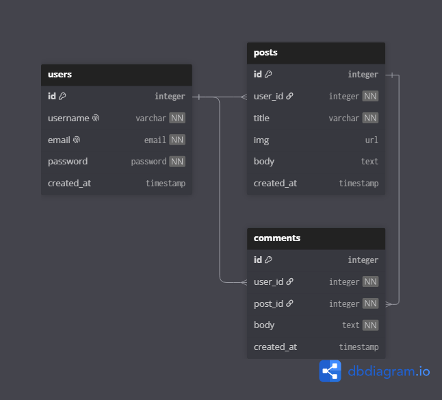

<style>
    .header {
        display: flex;
        flex-direction: column;
        justify-content: center;
        align-items: center;
    }
</style>

<header class="header">
    <h1>
        Simple Blog App in Flutter
    </h1>
    <p> A simple blog application made with flutter </p>
</header>

## Contents
1. [Features](#features)
2. [Project structure](#project-structure)
2. [Database](#database)

## Features
 - User authentication
 - Create, edit, and delete posts and comments
 - Comment on posts
 - Responsive UI

## Project Structure
```text
lib/
├── controllers/
├── models/
│   ├── user.dart
│   ├── post.dart
│   └── comment.dart
├── services/
│   ├── auth_service.dart
│   └── supabase_service.dart
├── views/
│   ├── login_page.dart
│   ├── home_page.dart
│   └── create_post_page.dart
└── main.dart
```

| folder      | Description                                                    |
|-------------|----------------------------------------------------------------|
| `controllers` | contains the logic that integrates both the view and the model |
| `models`      | defines the database models                                    |
| `utils`       | stores varying utility functions                               |
| `views`       | contains the pages of the app                                  |

## Database

This project uses Supabase as its backend database service (BaaS).

The following Entity Relationship (ER) Diagram illustrates the relationships between the tables throughout the application. 



---

### Table descriptions

The following sections will describe the purpose, responsibilities, and relationships of each table in the database.


####  Users

The `users` table stores information about each *registered* user within the application. A user may create multiple posts and comments.

- One-to-many with `posts`
- One-to-many with `comments`

#### Posts

The `posts` table stores content created by users. Each post has a madatory title, an optional image and body.

 - One-to-many with `comments`
 - Many-to-one with `users`

#### Comments

The `comments` table stores user comments associated with a post. Each comment is authored by a user and belongs to a single post.

 - Many-to-one with `users`
 - Many-to-one with `posts`

