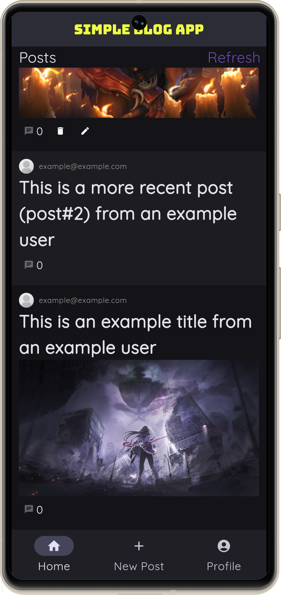
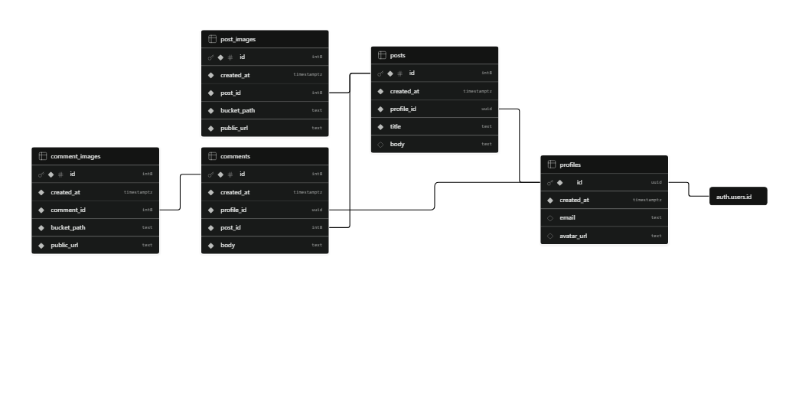

<p align="center">

</p>

# Simple Blog App


A simple blog application made with flutter and supabase that allows 
authenticated users to create, edit, and manage blog posts with image
uploads.

The web app uses [Vercel](https://vercel.com/) as its primary hosting platform.

---

## Contents
1. [Features](#features)
1. [Project structure](#project-structure)
1. [Database](#database)
1. [Possible Improvements](#possible-improvements)

---

## Features

### Authentication
| Feature | Status |
|---|---|
| User registration (email & password) | [x] Working |
| User login | [x] Working |
| User logout | [x] Working |

### Posts
| Feature | Status | Additional Notes
|---|---|---|
| Public post listing | [x] Working |
| Multiple image preview | [x] Working |
| Pagination | [ ] Planned | My plan involves on doing a a traditional page-based pagination using Supabase' `range()` [modifier](https://supabase.com/docs/reference/dart/using-modifiers-range). combined with the `select()` [function](https://supabase.com/docs/reference/dart/select).
| Create post | [x] Working |
| Upload post images | [x] Working |
| Delete post images | [ ] Planned | I plan on creating another custom widget that has its own delete icon button.
| View post details | [x] Working |
| Update post | [x] Working |
| Delete post | [x] Working |

### Comments
| Feature |Status| Additional Notes
|---|---|---|
| Add comments | [x] Working | 
| Update comments | [ ] Planned | For most of these functions, I plan on implementing them on the `posts_viewmodels.dart`. They basically will invoke methods from the [Supabase flutter library](https://supabase.com/docs/reference/dart/introduction): 
| Delete comments | [ ] Planned |
| Upload comment images | [ ] Planned |
| Delete comment images | [ ] Planned |

---

## Project Structure
```text
lib/
├── models/
├── services/
├── theme/
├── viewmodels/
├── views/
│   ├── auth/
│   └── posts/
├── widgets/
└── main.dart
```

| Folder | Description |
|---|---|
| `models/` | Defines models that represent entities retrieved from or stored in the database. |
| `services/` | Contains integrations with external services, including Supabase authentication, storage, and file handling. |
| `theme/` | Defines the overall visual design of the application, including colors, and typography. |
| `viewmodels` | Defines the viewmodels which acts as the intermediary between views and services. These manage the  application state by following MVVM architecture.  |
| `views` | Contains the application's pages and screens that represent the user interface. |
| `views/auth` | Contains pages related to authentication |
| `views/posts` | Contais pages related to viewing and editing posts. |
| `widgets` | Houses reusable and specific components that are shared across multiple views. |

---

## Database

This project uses [Supabase](https://supabase.com/) as its [backend database service (BaaS)](https://en.wikipedia.org/wiki/Backend_as_a_service).

The following Entity Relationship (ER) Diagram illustrates the current relationships between the tables throughout the application. 



---

## Possible Improvements

Would definitely add these after the main features:
- Visual feedback on some user actions
- Post search
- Responsive layout
- Upload user-specific profile photos
- Rich text post and comments editor